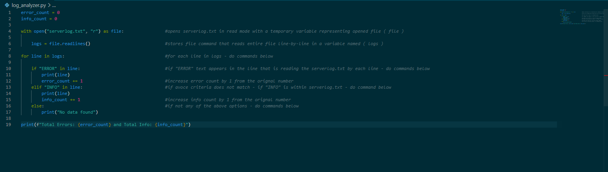
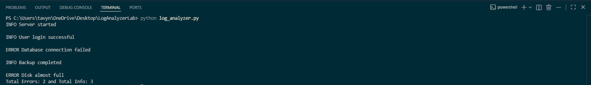

<h1>Log Analysis Script </h1>

<h2>Overview:</h2> 

This project stimulates real-world server log monitoring by:
- Reading log files
- Detecting error entries
- Counting failures automatically

<h2>Skills Demonstrated</h2>

- Python scripting 
- File handling 
- Log analysis 
- Automation logic
- Error detection 
- Looping and conditional statements

<h2>Technologies Used:</h2>

- Python
- VS Code

<h2>How to Run</h2>

```bash python log_analyzer,py```

<h2>Code and Output</h2>



