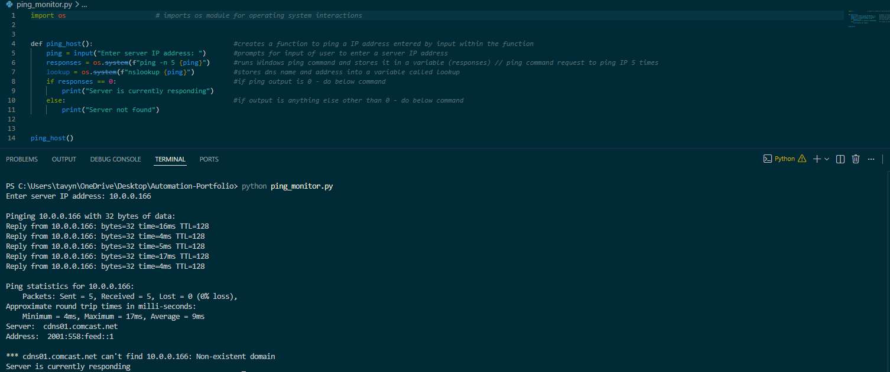

<h1>Ping Server Script</h1>

<h2>Overview:</h2> 

This project stimulates automatic response based scripts:
- Real-time ping request output
- Detecting server status

<h2>Skills Demonstrated</h2>

- Python scripting 
- Automation logic
- Looping and conditional statements

<h2>Technologies Used:</h2>

- Python
- VS Code

<h2>How to Run</h2>

```bash python ping_monitor.py```

<h2>Code and Output</h2>

